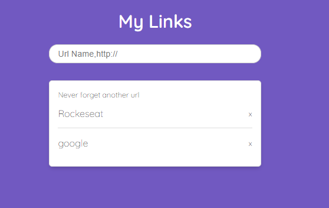

<h1 align="center">
    
</h1>

  <a href="#rocket-tecnologias">Tecnologias</a>&nbsp;&nbsp;&nbsp;|&nbsp;&nbsp;&nbsp;
  <a href="#-projeto">Projeto</a>&nbsp;&nbsp;&nbsp;|&nbsp;&nbsp;&nbsp;
  <a href="#-como-rodar">Como rodar</a>&nbsp;&nbsp;&nbsp;|&nbsp;&nbsp;&nbsp;
  <a href="#-como-contribuir">Como contribuir</a>&nbsp;&nbsp;&nbsp;
  

 

 

  

###### Na tela é possivel adicionar uma nova ULR com eses formato "teste, http://www.teste.com".
###### Para excluir basta clicar no X ao lado do nome.

## Curso Rocketseat - MasterClass #11

## 🚀 Tecnologias

Esse projeto foi desenvolvido com as seguintes tecnologias:

- [Node.js](https://nodejs.org/en/) - v14.4.0
- [Yarn](https://yarnpkg.com/) - 1.22.4
- [Npm](https://www.npmjs.com/) - 6.14.5

## 💻 Projeto

Esse projeto foi feito acompanhando a video aula do Youtube, [clique aqui](https://www.youtube.com/watch?v=DiXbJL3iWVs&t=1812s) para acessar.

## 🚀 Como Rodar

- Clone o projeto.
- Roder o comando "npm install" para instalar as dependências.
- Roder o comando "npm run api" para inicar a API.
- Roder o comando "npm start" para iniciar a parte visual.
- Para testar a API acesse localhost:3000.
- Para testar o Layout acesse localhost:5000.

#### API

###### Retornar todos os dados.
http://localhost:3000
###### Adicionar.
http://localhost:3000?name=teste&url=https://teste1.com.br
###### Escluir.
http://localhost:3000?name=teste&url=https://teste1.com.br&del=1

## 🤔 Como contribuir

- Faça um fork desse repositório;
- Cria uma branch com a sua feature: `git checkout -b minha-feature`;
- Faça commit das suas alterações: `git commit -m 'feat: Minha nova feature'`;
- Faça push para a sua branch: `git push origin minha-feature`.

Depois que o merge da sua pull request for feito, você pode deletar a sua branch.

